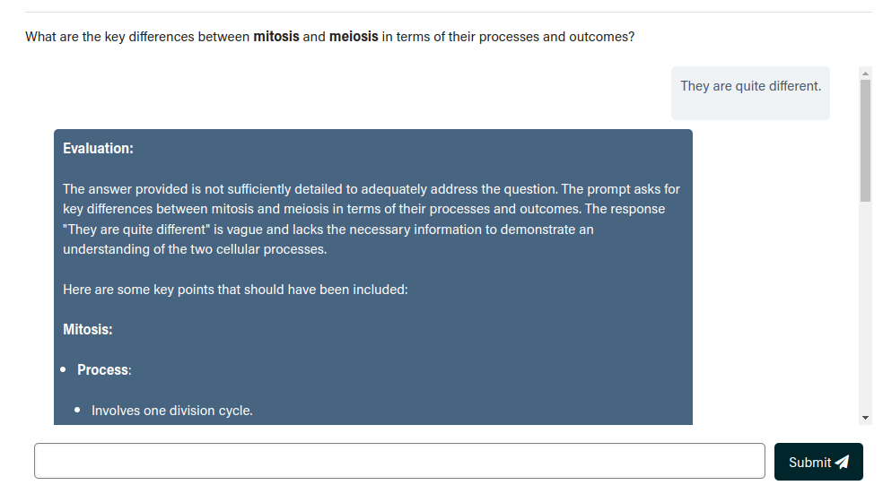
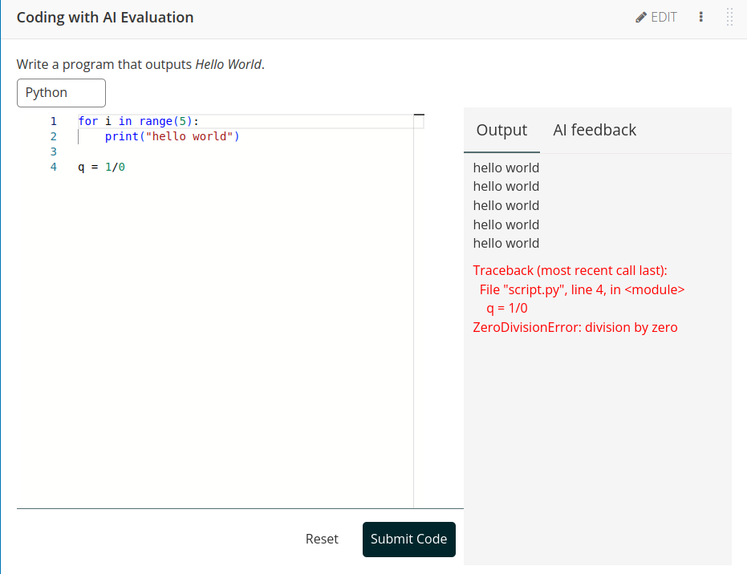
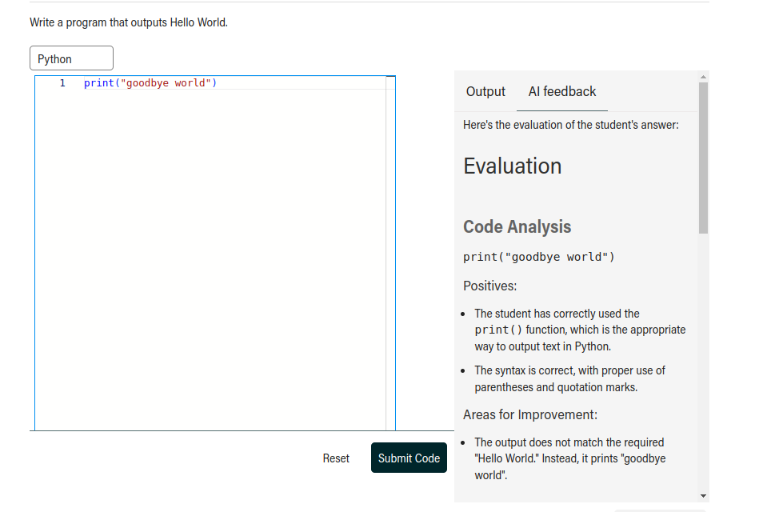
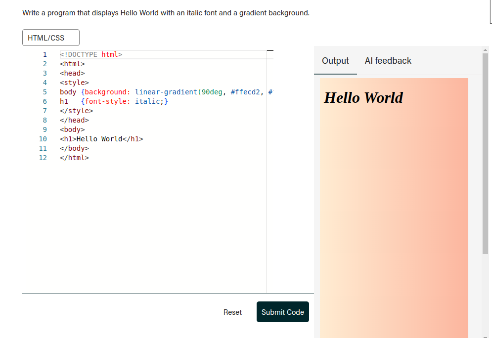

## Introduction

This repository hosts two Open edX XBlocks: 

1. **Short Answer with AI Evaluation**: This XBlock allows students to submit short answers, which are then evaluated with the help of a large language model (LLM).
2. **Coding with AI Evaluation**: This XBlock allows students to submit code in a text editor. The code is executed via a third-party API (currently using [Judge0](https://judge0.com/)), and both the code and its output are sent to an LLM for feedback.

## Screeshots

|  |  |
|-----------------------------------------------------------------------|----------------------------------------------------------------|
|  |  |


## Setup

### Using Tutor

1. Add the following line to the `OPENEDX_EXTRA_PIP_REQUIREMENTS` in your Tutor `config.yml` file:
   ```yaml
   OPENEDX_EXTRA_PIP_REQUIREMENTS:
     - git+https://github.com/open-craft/xblock-ai-evaluation
   ```
   You can append  `@vX.Y.Z` to the URL to specify your desired version.

2. Launch Tutor.

3. In the Open edX platform, navigate to `Settings > Advanced Settings` and add `shortanswer_ai_eval` and `coding_ai_eval` to the `Advanced Module List`.

4. Add either XBlock using the `Advanced` button in the `Add New Component` section of Studio.

5. Configure the added Xblock and make sure to add correct API keys. You can format your question and prompts using [Markdown](https://marked.js.org/demo/).

### API Key Configuration

The XBlocks support multiple ways to configure API keys for language models.  
The system will check for API keys in the following order:
1. **XBlock-level configuration**: API keys can be set directly in each XBlock instance through the Studio UI.
2. **Site configuration**: API keys can be set globally for all XBlocks using Open edX's Site Configuration.
   To configure API keys in Site Configuration, navigate to `Django admin > Site Configurations` and add the following keys:
   ```json
    {
        "ai_eval": {
             "GPT4O_API_KEY": "your-openai-api-key"
        }
    }
    ```
3. **Django settings**: API keys can be defined in the Django settings. 
   To configure API keys in Django settings (e.g., in Tutor), add the following to your configuration:
   ```python
   XBLOCK_SETTINGS = {
       "ai_eval": {
           "GPT4O_API_KEY": "your-openai-api-key",
        }
    }
    ```

#### Security Considerations

For better security, we recommend using site configuration or Django settings instead of configuring API keys at the 
XBlock level. This prevents API keys from being exposed in course exports.

## Dependencies
- [Judge0 API](https://judge0.com/)
- [Monaco editor](https://github.com/microsoft/monaco-editor)
- [LiteLLM](https://github.com/BerriAI/litellm)
